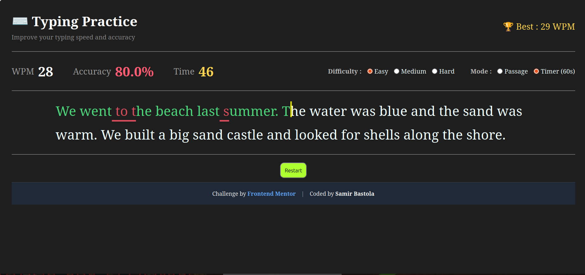

# Typing Practice

A responsive typing speed test built with HTML, CSS, and vanilla JavaScript. Practice with passages at different difficulty levels, track your speed and accuracy, and compare your results with your saved personal best.

## Table of Contents

- [Overview](#overview)
- [Features](#features)
- [Built With](#built-with)
- [How to Use](#how-to-use)
- [Project Structure](#project-structure)
- [Deployment](#deployment)
- [What I Learned](#what-i-learned)
- [Future Improvements](#future-improvements)
- [Author](#author)
- [Acknowledgments](#acknowledgments)

## Overview

Typing Practice is a browser-based typing tutor for measuring typing speed and accuracy. The app presents a randomly selected passage, highlights correct and incorrect characters as you type, and displays a results summary when the test is complete.

### Live Demo

[View the live demo](https://samirbastolangit.github.io/typing-speed-test/)

### Preview



## Features

- Displays words per minute (WPM) while typing
- Calculates typing accuracy in real time
- Shows elapsed time for Passage mode, which ends when the passage is completed
- Includes a 60-second countdown Timer mode, which ends automatically at zero
- Offers Easy, Medium, and Hard difficulty levels
- Loads random passages from `data.json`
- Highlights correct and incorrect characters
- Shows correct and incorrect character totals after each test
- Saves the best WPM score in browser `localStorage`
- Supports restarting the test with a new passage
- Responsive layout for desktop, tablet, and mobile screens
- Includes keyboard focus behavior so typing can continue after clicking the page

## Built With

- Semantic HTML5
- CSS3
- CSS custom styling and responsive media queries
- Vanilla JavaScript
- Browser Fetch API
- Browser `localStorage`
- [Sora](https://fonts.google.com/specimen/Sora) font

### Prerequisites

You only need a modern web browser and a local development server. Because the app fetches passages from `data.json`, opening `index.html` directly with a `file://` URL may prevent the passages from loading in some browsers.

### Run Locally

1. Clone the repository:

   ```bash
   git clone https://github.com/samirbastolangit/typing-speed-test.git
   ```

2. Move into the project directory:

   ```bash
   cd typing-speed-test
   ```

3. Start a local server. For example, with Python:

   ```bash
   python3 -m http.server 8000
   ```

4. Open [http://localhost:8000](http://localhost:8000) in your browser.

You can also use the Live Server extension in VS Code.

## How to Use

1. Choose a difficulty level: Easy, Medium, or Hard.
2. Choose Passage mode or Timer mode.
3. Select **Start** or click the blurred passage to begin.
4. Type the passage exactly as shown.
5. Review your WPM, accuracy, correct characters, and incorrect characters when the test ends.
6. Select **Restart** to begin another test.

Passage mode tracks the time until you finish the selected passage. Timer mode gives you 60 seconds and ends automatically when the countdown reaches zero.

## Project Structure

```text
.
├── assets/
│   ├── fonts/
│   └── images/
├── data.json          # Typing passages grouped by difficulty
├── index.html         # Page structure and controls
├── script.js          # Typing logic, timers, scoring, and local storage
├── style.css          # Layout, theme, and responsive styles
└── README.md
```

## Deployment

This project does not require a build command or environment variables. It can be deployed as a static website on GitHub Pages, Netlify, Vercel, Cloudflare Pages, or any similar static hosting provider.

For GitHub Pages:

1. Push the project to a GitHub repository.
2. Open the repository's **Settings**.
3. Select **Pages** under **Code and automation**.
4. Choose the `master` branch and the root folder as the deployment source.
5. Save the settings and wait for GitHub to publish the site.

Make sure `index.html`, `script.js`, `style.css`, and `data.json` are deployed together. The app needs `data.json` to load the typing passages.

## What I Learned

- How to use DOM events to build an interactive typing experience
- How to render individual passage characters as separate elements
- How to calculate WPM and accuracy from user input
- How to manage passage and countdown timers with `setInterval`
- How to persist a personal best score with `localStorage`
- How to create a responsive layout with CSS media queries

## Future Improvements

- Add a reset button for the saved personal best
- Add more passage categories and custom passage input
- Improve keyboard-only focus visibility and screen-reader announcements
- Add a results history instead of storing only the best WPM
- Add a pause control for Timer mode
- Add automated tests for scoring and timer behavior

## Author

- Name: Samir Bastola
- GitHub: [@samirbastolangit](https://github.com/samirbastolangit)
- Repository: [typing-speed-test](https://github.com/samirbastolangit/typing-speed-test)

## Acknowledgments

- [Frontend Mentor](https://www.frontendmentor.io/) for the original Typing Speed Test challenge and design direction
